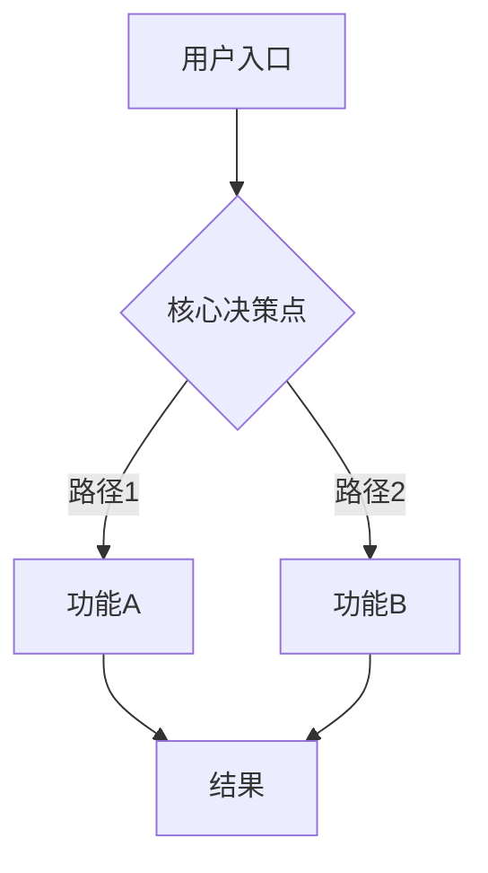
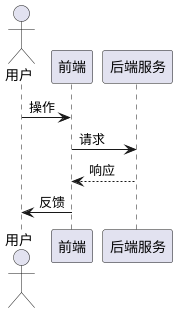

# PRD — {{project_name}} ({{feature_id}})

> 编写规范详见 `.claude/templates/PRD-writing-guide.md`。
> 标记 `<!-- optional -->` 的模块按需保留或删除。

## 1. 业务目标

| 维度 | 内容 |
|------|------|
| 项目名称 | {{project_name}} |
| 目标用户 | <!-- 一句话描述 --> |
| 核心价值 | <!-- 用户能获得什么 --> |
| 成功指标 | <!-- 关键数据指标及期望值 --> |
| 预估用户量级 | <!-- PV/UV 预估 --> |
| 预计上线 | <!-- 日期 --> |

<!-- optional: 有明确业务分支流程时保留此模块 -->
## 2. 业务流程图

<!-- optional: 涉及多角色/多系统交互时保留此模块 -->
## 3. 时序图

## 4. 功能模块

<!-- 按「功能模块 → 功能点」分层。每个功能点须包含 6 要素。 -->

### 4.1 模块名称

#### 4.1.1 功能点名称

**功能概述**: <!-- 一句话说明目的和核心价值 -->

**前置条件**: <!-- 用户/系统需处于的状态 -->

**操作步骤**:

1. <!-- 每步只做一件事 -->
2.
3.

**预期结果**:

1. <!-- 对应操作步骤，明确系统响应：页面跳转、弹窗文案、元素变化、数据状态 -->
2.
3.

**异常情况**:

| 异常场景 | 系统响应 |
|---------|---------|
| <!-- 如：输入非法手机号 --> | <!-- 如：toast 提示"手机号格式不正确" --> |
| | |

**业务规则与数据约束**:

- <!-- 限制条件、字段类型、取值范围、计算规则 -->

---

### 4.2 模块名称

#### 4.2.1 功能点名称

<!-- 同上 6 要素格式 -->

---

<!-- optional: 多个功能模块存在数据流转或页面跳转时保留此模块 -->
## 5. 功能交互

| 交互链路 | 数据流转 | 影响 |
|---------|---------|------|
| 操作 A → 触发 B → 系统响应 C | <!-- 数据传递方式 --> | <!-- 对后续功能的影响 --> |
| | | |

## 6. 功能边界

**包含**:
-

**不包含（本版本不做）**:
-

## 7. 非功能约束

> 按需填写，不适用的删除。涉及资金安全的必须填写安全项。

- **性能**: <!-- 并发量、响应时间，如「核心接口 500QPS、响应 ≤1s」 -->
- **安全**: <!-- 防刷机制、数据加密，如「同一 IP 每分钟最多 5 次请求」 -->
- **数据一致性**: <!-- 异常场景数据恢复，如「中途退出保留进度 ≥24h」 -->
- **兼容性**: <!-- 如需要 -->

## 8. 验收标准

- [ ] <!-- 验收条件 1 -->
- [ ] <!-- 验收条件 2 -->
- [ ] <!-- 验收条件 3 -->

## 9. 关联文档

- 项目概览: `../../begin.md`
- 进度追踪: `.artifacts/process.md`
- 决策记录: `.artifacts/notes.md`
