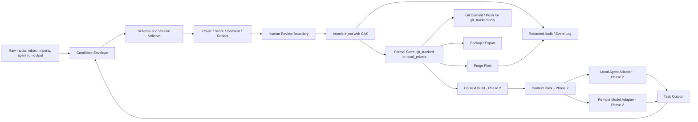

# GoldenWave Threat Model v0.1

## 1. Scope and decision frame

This document models the security, privacy, integrity, and recovery risks for GoldenWave Phase 0 through the planned Phase 2 golden path. It uses only repository documents and the sanitized KnowledgeBase inventory from 2026-07-25. It does not read or copy any private KnowledgeBase body content.

Phase boundaries in this threat model:

- Phase 1 covers Store/Govern controls: `adopt`, `doctor`, `validate`, candidate intake, review, inject, Git gates, backup restore verification, and honest diagnostics about replica/purge risk.
- Phase 2 adds Serve-path controls: `context build`, `Context Pack`, cross-agent adapters, remote-model egress execution, and prompt-injection/context-poisoning adversarial suites.
- Phase 1 may enforce deterministic candidate/ingest content-vs-instruction separation and provenance/freshness checks, but it does not claim the full Context Pack adversarial protections required for Phase 2.
- Purge, export, and productized backup flows are modeled here because they change the threat surface, but unless the feature exists they are not implied Phase 1 deliverables.

In scope:

- local store and governed paths for `git_tracked`, `local_private`, and `ephemeral`
- `adopt`, `doctor`, `validate`, candidate intake, review, inject, Git gates, backup restore verification, and feature-exists-prerequisite diagnostics for purge/export in Phase 1
- `context build`, `Context Pack`, local/remote adapters, and cross-agent egress checks in Phase 2
- local adapters and local automation around Claude Code, Codex, Hermes, Multica, and other agents
- Git history, Git remotes, backup/export surfaces, and recovery claims
- remote model use through explicit `remote_model` scope

Out of scope:

- OS or disk compromise on the user's machine
- remote model vendor internals after an authorized upload
- third-party systems claiming deletion outside GoldenWave-managed replicas
- runtime orchestration features that GoldenWave explicitly does not own

## 2. Security objectives

GoldenWave Phase 1 must fail closed on boundary violations and must not trade privacy for convenience.

Primary objectives:

1. Prevent unauthorized persistence of `local_private` and `ephemeral` content into Git history, logs, filenames, indexes, exports, or remote models.
2. Prevent unauthorized writes into formal layers by forcing all automated learning through candidate validation, review, and atomic inject.
3. Preserve provenance, authorization scope, freshness, and storage class across every ingest and serve path.
4. Remain correct under concurrent agents, dirty worktrees, process crashes, and replayed candidate operations.
5. Make purge claims precise: GoldenWave may report managed replicas and unresolved external replicas, but must not claim universal deletion.

## 3. Assets and trust boundaries

### 3.1 Asset inventory

| Asset | Examples | Default sensitivity | Main risks |
|---|---|---|---|
| Formal `git_tracked` assets | `profile/`, `wiki/`, `projects/`, accepted low-risk summaries | L0-L2, some L3 legacy drift | wrong writes, stale facts, Git overexposure |
| Formal `local_private` assets | `.private/social/`, future private L1 records | L3 by default | Git leakage, remote exfiltration, purge mismatch |
| `ephemeral` material | raw chats, imports, temporary transforms | mixed, often high | accidental persistence, log leakage |
| Candidate envelopes | inbox entries, pending social candidates, review diffs | mixed | prompt injection, schema confusion, replay |
| Context Packs | minimal authorized task context, Phase 2 only | mixed | over-sharing, prompt injection, stale or poisoned context |
| Audit and diagnostics | event logs, doctor reports, purge reports | low if redacted | metadata leakage, false safety claims |
| Git history and remotes | local repo history, hosted remote, clones | inherited from tracked data | irreversible copies, purge gap |
| Backups and exports | zip, snapshot, archive, external copy | inherited from included data | unmanaged replica drift |

### 3.2 Trust boundaries

| Boundary | Description | Why it matters |
|---|---|---|
| B1 User approval boundary | human owner decides accept/reject, storage promotion, remote use, and purge actions | prevents silent widening of scope |
| B2 Governed filesystem boundary | only whitelisted GoldenWave paths may be read or written by inject/purge code | blocks path traversal and symlink escape |
| B3 Process boundary | GoldenWave logic runs beside Hermes, Multica, Claude Code, Codex, and other local tools | concurrent actors can race or replay stale state |
| B4 Network boundary | Git remotes, remote model providers, and future external adapters are outside the trusted local machine | data sent across it may persist elsewhere |
| B5 Replica boundary | backups, exports, clones, and user-managed snapshots are not equivalent to the active local store | purge and recovery promises differ by replica type |
| B6 Review boundary | candidate creation is separate from accepted formal injection | prevents producers from self-authorizing writes |

## 4. Roles and permission matrix

Approved role model for Phase 1:

| Role | Read `git_tracked` | Read `local_private` | Create candidate | Approve formal inject | Commit/push formal data | Send data to remote model | Purge managed local data |
|---|---|---|---|---|---|---|---|
| Human owner | Yes | Yes | Yes | Yes | `git_tracked` only after policy check | Yes, only when the single action/purpose/consent predicate below passes | Only after capability D2 approval and fresh per-execution B1 confirmation |
| Local trusted agent/CLI | Yes | Yes, only per contract and task need | Yes | No; may only execute injects the human explicitly accepted | `git_tracked` only after policy check | No by default; may execute only a pre-authorized request that passes the same predicate below | May execute only the exact operation covered by fresh B1 confirmation after capability D2 approval |
| Hermes / Multica / local automation | Metadata and approved formal data only | No by default | Yes | No | No | No | No |
| External producer | No direct store access | No | Yes, envelope only | No | No | No | No |
| Remote model provider | No direct repo access | No direct repo access | No | No | No | N/A | No |
| Git remote | `git_tracked` replica only after policy-gated commit/push | No | No | No | Passive replica only | N/A | No |
| Backup target | Replica only through C8 | Replica only through C8 encryption and integrity-manifest controls, plus the Section 4 consent predicate when applicable | No | No | No; backup creation is not Git commit/push | N/A | No |

Role resolution is deny-first and uses the most specific role. Hermes, Multica, and other local automation remain subject to the automation row even when their process also qualifies as a local agent or CLI; overlapping role labels never upgrade their permissions. A human owner may authorize an operation only within the consent predicate below and cannot delegate approval of a formal inject to an agent. Human ownership never bypasses the storage-class gate: Git commit/push carries only policy-approved `git_tracked` data, while backup replication is a separate C8 flow and never a Git path for `local_private`.

Non-negotiable constraints already approved by SPEC and roadmap:

- external producers never gain `share`, `remote_model`, `commit`, or `push` rights merely by passing Contract validation
- third-party sensitive data defaults to `local_private`; raw third-party chats default to `ephemeral`
- promotion from `local_private` to `git_tracked` requires explicit human confirmation with Git-history warning
- `doctor` and `validate` must fail closed on missing `.private/` ignore rules or tracked `local_private`
- one authorization predicate governs `share`, `export`, and `remote_model`: when data is third-party sensitive, contains personality inference, or carries a policy tag designated by governance as consent-required, execution requires data-subject `explicit_consent` whose permitted action and purpose match, whose `basis` is `explicit_consent`, whose `retention_until` is still valid, whose `revoked_at` is null, and whose policy tags permit that action and purpose
- actor authority, including human operator export authority, is necessary but cannot substitute for the data subject's consent; `self_context`, `public_source`, a broader local-agent role, or prior approval for a different purpose is insufficient

## 5. Data flow

Data-flow rules:

- Validation happens before any path resolution or file write.
- Redaction happens before logging, review rendering, export rendering, or remote-model egress.
- Backup and export are not redaction mechanisms; they require a pre-approved storage-class decision, authorization check, integrity manifest, and encryption when carrying `local_private`.
- Accepted inject must use an active-base CAS check plus a serialized commit point such as a lock/lease or atomic manifest pointer so losers cannot commit and readers only observe complete snapshots.
- Git commit, push, forced add, and Hermes-triggered sync must all re-check storage-class policy before replica creation.
- If a purge feature exists, it must stop query, suggestion, export, and automatic rebuild use; clean formal store, indexes, caches, derived summaries, and reverse references; redact retained tombstones to minimal non-sensitive identifiers and disposition state; and recover idempotently from a multi-file purge journal before reporting unresolved replicas.

## 6. Risk scoring rubric

### 6.1 Likelihood

| Score | Meaning |
|---|---|
| 1 | needs unusual conditions or privileged attacker behavior |
| 2 | plausible edge case in normal development or dogfooding |
| 3 | likely during multi-agent or legacy KnowledgeBase adoption |
| 4 | expected without explicit control |

### 6.2 Impact

| Score | Meaning |
|---|---|
| 1 | localized, reversible, no sensitive data exposure |
| 2 | user-visible integrity or availability issue, limited sensitive scope |
| 3 | material privacy or integrity breach, or misleading purge/recovery claim |
| 4 | irreversible replica leak, cross-boundary exfiltration, or broad corruption |

### 6.3 Severity

`risk_score = likelihood x impact`

| Score | Severity | Release meaning |
|---|---|---|
| 12-16 | Critical | must be fail-closed before the first target-phase gate where the risky capability is exposed |
| 8-11 | High | must have enforced control and test before the target-phase gate that first exposes the capability |
| 4-7 | Medium | plan control before or within the target phase and document residual risk at that gate |
| 1-3 | Low | acceptable only with explicit documentation at the relevant target-phase gate |

## 7. STRIDE threat inventory

| ID | STRIDE | Threat scenario | Affected boundary/assets | L | I | Score | Reason | Target phase | Control target | Test mapping |
|---|---|---|---|---:|---:|---:|---|---|---|---|
| T1 | Tampering / EoP | Candidate or ingest material embeds instructions in body text, frontmatter, or attachment metadata and tricks governance code or reviewers into widening behavior. | B3, B6, candidates | 3 | 3 | 9 | Design assumption: mixed-agent ingest makes embedded instructions plausible and untreated content can induce wrong writes or leakage | Phase 1 | C3, C5 | TM-P1-T03, TM-P1-T07 |
| T2 | Tampering / EoP | Prompt injection inside Phase 2 Context Pack or source snippets causes an agent to ignore policy, reveal secrets, or perform unsafe actions. | B3, B4, Context Pack | 3 | 4 | 12 | Design assumption: once the serve path exists, untrusted snippets can cross agent and network boundaries | Phase 2 | C13, C14 | TM-P2-T02, TM-P2-T04 |
| T3 | Tampering | Candidate poisoning turns inference into fact, accepts items with missing provenance, malicious metadata, expired freshness, or silent conflict overwrite. | B6, formal store | 3 | 3 | 9 | Inventory evidence: adoption material has freshness and consistency gaps that make stale or conflicting data expected | Phase 1 | C4, C6, C10 | TM-P1-T07, TM-P1-T10 |
| T4 | Spoofing / Tampering | Malformed or downgraded Contract version claims trusted producer status or bypasses required fields. | candidates, B6 | 2 | 4 | 8 | Design assumption: malformed versions are less frequent than stale data but can bypass the whole gate if validation is weak | Phase 1 | C5 | TM-P1-T03 |
| T5 | Tampering / EoP | Path traversal such as `../`, absolute paths, or encoded separators escapes governed roots during inject, adopt repair, or a purge feature if one exists. | B2, formal store, logs | 4 | 4 | 16 | Design assumption: traversal is an expected attack class against file writers and directly breaks B2 | Phase 1 inject/repair; purge only if feature exists | C1 | TM-P1-T01 |
| T6 | Tampering / EoP | Symlink or hardlink under a governed path points into `.git`, user secrets, or another project and receives inject/repair writes or purge operations if that feature exists; a parent-directory symlink swap races a check against the later write. | B2, B5 | 4 | 4 | 16 | Design assumption: link tricks and directory-swap races can bypass path-string or pre-open checks | Phase 1 inject/repair; purge only if feature exists | C1, C6 | TM-P1-T02 |
| T7 | Information Disclosure | Logs, doctor output, indexes, structured event fields, stack traces, temp paths, or error messages leak private names or raw sensitive text even when the main body stays private. | audit, diagnostics, indexes | 3 | 4 | 12 | Design assumption: observability has many sinks and leaked diagnostics are hard to retract | Phase 1 | C7 | TM-P1-T04 |
| T8 | Information Disclosure | `local_private` or `ephemeral` data enters Git history, Git remote, or a clone because `.private/` is not ignored, `git add -f` bypasses defaults, storage_class drifts, or Hermes sync runs after a bad stage. | Git history, B4, KB inventory gap R1/R3/R4 | 4 | 4 | 16 | Inventory evidence: ignore, tracking, classification, and automation drift already exist; replica creation can be effectively irreversible | Phase 1 | C2, C12 | TM-P1-T05, TM-P1-T13 |
| T9 | Information Disclosure | `share`, `export`, or remote-model egress occurs without valid action/purpose scope, or protected data is sent without matching data-subject `explicit_consent`, valid retention, unrevoked status, and policy-tag allowance. | B4, B5, local_private, future Context Pack | 4 | 4 | 16 | Inventory evidence: classification drift exists; approved policy establishes that operator authority is not equivalent to data-subject consent | Phase 1 gate, Phase 2 execution | C4, C8, C14 | TM-P1-T06, TM-P2-T04 |
| T10 | Tampering / DoS | Concurrent Hermes, Multica, agent, or CLI injects cause lost updates, duplicate injects, or index/content divergence; separately, if purge exists, concurrent purge/query/rebuild can resurrect or expose removed data. | B3, formal store, audit | 3 | 4 | 12 | Inventory evidence: concurrent local automation exists; purge concurrency is a design assumption only when that feature exists | Phase 1 inject; purge only if feature exists | C6; C9 for purge | TM-P1-T08; TM-P1-T12 only if purge exists |
| T11 | Tampering / DoS | Crash, power loss, or forced stop occurs mid-inject, or mid-purge if that feature exists, leaving partial files, dangling references, inconsistent review state, or a partially advanced manifest pointer. | B3, B5, formal store | 3 | 4 | 12 | Design assumption: interrupted multi-file writes threaten integrity unless commit order is serialized and journaled | Phase 1 inject; purge only if feature exists | C6; C9 for purge | TM-P1-T09; TM-P1-T12 only if purge exists |
| T12 | Information Disclosure / Repudiation | Backup or export creates unauthorized or weakly protected replicas, lacks encryption/integrity proof, uses operator authority as a substitute for consent, or implies deletion succeeded while unmanaged replicas still exist. | B5, backups, exports, purge claims | 3 | 3 | 9 | Design assumption: replica creation without one consent predicate can cause sprawl or false deletion claims | Feature exists prerequisite; Phase 1 only requires honest diagnostics and restore evidence | C8, C9 | TM-P1-T11, TM-P1-T12 |
| T13 | Spoofing / Repudiation | A user or tool replays an old accept/reject action after the base data changed and claims the resulting write was valid. | B6, audit, formal store | 2 | 4 | 8 | Design assumption: asynchronous review makes stale approvals plausible and breaks traceability | Phase 1 | C6, C10 | TM-P1-T10 |
| T14 | EoP | `doctor` or `adopt` auto-fix mode mutates a live dirty KnowledgeBase, stages changes, commits, or broadens access beyond read-only expectations. | B1, B3, KB inventory gap R6 | 3 | 3 | 9 | Inventory evidence: dirty worktrees and local automation are normal conditions, so surprise mutation is credible | Phase 1 | C11, C12 | TM-P1-T13, TM-P1-T14 |
| T15 | DoS / Info Disclosure | Phase 2 context build over-includes the full library or oversized sources, causing capacity blowups or accidental broad disclosure to local or remote agents. | Context Pack, B3, B4 | 2 | 3 | 6 | Design assumption: controlled retrieval can reduce over-inclusion only after the serve path exists | Phase 2 | C13 | TM-P2-T01, TM-P2-T04 |
| T16 | Tampering | Phase 2 cross-agent context poisoning causes one agent's stale, malicious, or conflicting output to be consumed as trusted context by another. | B3, B4, Context Pack, candidates | 3 | 4 | 12 | Design assumption: cross-agent reuse amplifies poisoned context once the serve path is live | Phase 2 | C13, C14 | TM-P2-T03, TM-P2-T04 |

## 8. Controls and required tests

### 8.1 Phase 1 controls

| Control | Fail-closed rule | Required tests |
|---|---|---|
| C1 Canonical path and link guard | reject absolute paths, traversal, and hardlinks with unexpected inode/link-count; resolve every component relative to a trusted root directory descriptor with no-follow semantics and perform mutation through that descriptor. Where a platform lacks equivalent primitives, open first, verify the opened descriptor's inode and ancestor chain against the trusted root, and perform mutation only through that verified descriptor; a path-string or pre-open check alone is insufficient | TM-P1-T01 traversal fixtures, TM-P1-T02 link and parent-directory swap-race fixtures |
| C2 Storage-class gate | reject if `.private/` is not ignored, if tracked files resolve to `local_private`, if `ephemeral` targets a formal directory, or if legacy path semantics contradict declared storage_class | TM-P1-T05 doctor/adopt boundary fixtures |
| C3 Candidate content/instruction split | treat candidate body, frontmatter, filenames, and extracted metadata as untrusted data; Phase 1 does not claim full Context Pack adversarial resistance | TM-P1-T03 malformed envelope fixtures, TM-P1-T07 poisoning fixtures |
| C4 Authorization gate | require explicit action and purpose scope for `store`, `summarize`, `suggest`, `share`, `export`, and `remote_model`; apply the single consent predicate in Section 4 to every protected-data `share`, `export`, or `remote_model` execution | TM-P1-T06 authorization and role-precedence fixtures |
| C5 Schema/version validator | only allow known major versions, enforce required fields, storage_class enums, provenance fields, freshness fields, path budget, and producer metadata | TM-P1-T03 malformed and downgraded envelope fixtures |
| C6 Atomic CAS inject | every accepted write requires idempotency key, active-base hash, link-safe descriptor-relative replacement, and a serialized commit point via lock/lease or atomic manifest pointer. It must follow the commit-order invariant below; losers must not commit, readers must see only the snapshot named by the durable active manifest, and recovery must be idempotent | TM-P1-T02 link/race fixtures, TM-P1-T08 concurrency tests, TM-P1-T09 crash/power-loss recovery tests, TM-P1-T10 stale replay tests |
| C7 Redacted observability | logs, doctor, diff, purge reports, indexes, structured event fields, error messages, stack traces, and temp paths must expose only hashes, stable IDs, counts, and redacted snippets when justified | TM-P1-T04 metadata leakage fixtures |
| C8 Backup/export gate | Phase 1 minimum is honest diagnostics plus restore evidence; if backup/export features exist, eligibility derives from storage_class and the Section 4 authorization predicate, `local_private` replicas require encryption and integrity manifest, and operator authority cannot substitute for data-subject `explicit_consent` | TM-P1-T11 backup restore and diagnostics; TM-P1-T12 feature-exists prerequisite |
| C9 Purge propagation | Feature-exists prerequisite only: if purge exists, it must stop query, suggestion, export, and automatic rebuild use; remove or redact managed local bodies, caches, derived summaries, and reverse refs; retain only minimal non-sensitive tombstones needed for replay protection or audit; and recover idempotently from purge journal state | TM-P1-T12 feature-exists prerequisite, including concurrent and interrupted purge |
| C10 Review freshness and anti-poisoning | accept/reject token expires on base change; candidates missing provenance, using inference as fact, stale beyond refresh, malicious metadata, or silent conflict overwrite are rejected or re-opened | TM-P1-T07 poisoning fixtures, TM-P1-T10 stale review tests |
| C11 Mode separation | `doctor` read-only by default; repair mode is explicit, previewable, and never auto-commits or auto-pushes | TM-P1-T14 dirty-worktree and read-only behavior tests |
| C12 Git egress gate | `git add`, `git add -f`, commit, push, and Hermes sync must all enforce storage-class policy; when remote/history state is unknown, the system may warn or block but must not claim safety | TM-P1-T05 storage boundary fixtures, TM-P1-T13 Git/Hermes fixtures |

C6 commit-order invariant for an inject transaction:

1. Under the transaction's serialization primitive, write the prepared journal containing the active-base hash, complete target set, content hashes, and intended manifest; `fsync` the journal file and its parent directory.
2. Write every target to a new temporary inode through the trusted directory descriptor and `fsync` each file; do not expose it through the active manifest.
3. Rename each prepared inode into its final versioned name through trusted directory descriptors, then `fsync` every affected parent directory.
4. Write and `fsync` the complete immutable manifest, rename the active-manifest pointer atomically, then `fsync` the pointer's parent directory. This pointer update is the sole commit point.
5. Only after the durable pointer update, mark the journal committed and `fsync` it and its parent. Recovery before the commit point removes or ignores prepared artifacts; recovery after it completes bookkeeping without changing the committed snapshot.

`TM-P1-T09` must inject process crash and power loss after every numbered persistence boundary, including after each rename but before parent-directory `fsync`. The oracle requires the old or new complete manifest and matching content hashes, never a mixed snapshot; journal replay must converge when repeated.

### 8.2 Phase 2 controls

| Control | Fail-closed rule | Required tests |
|---|---|---|
| C13 Serve-path minimization | `context build` emits only minimum authorized context with size ceilings, source provenance, freshness, and explicit separation between content and instructions | TM-P2-T01 minimal-pack fixtures, TM-P2-T02 prompt-injection suite, TM-P2-T03 poisoning suite |
| C14 Cross-agent and remote egress gate | adapter execution re-checks policy, authorization scope, the Section 4 consent predicate, and data minimization before any local-agent or remote-model handoff; unauthorized content blocks handoff rather than redacting late | TM-P2-T02 prompt-injection suite, TM-P2-T03 poisoning suite, TM-P2-T04 adapter egress suite |

### 8.3 Test IDs

| Test ID | Purpose |
|---|---|
| TM-P1-T01 | reject `../`, absolute, and encoded traversal targets |
| TM-P1-T02 | reject symlink/hardlink escape and parent-directory symlink exchange races during inject/repair and, only if implemented, purge; verify descriptor-relative no-follow or opened-inode/ancestor checks and new-inode replacement |
| TM-P1-T03 | reject malformed, downgraded, or privilege-escalating candidate envelopes |
| TM-P1-T04 | prove logs, indexes, filenames, diffs, doctor output, structured fields, stack traces, error payloads, and temp paths stay redacted |
| TM-P1-T05 | fail closed when `.private/` ignore rules are missing, tracked private files exist, `ephemeral` enters formal paths, or `git add -f` attempts bypass policy |
| TM-P1-T06 | for every protected class and each of `share`, `export`, and `remote_model`, reject missing/mismatched action or purpose, non-data-subject consent, insufficient `basis`, absent/expired consent or retention, set `revoked_at`, or forbidding policy tags; prove Hermes/Multica cannot inherit broader local-agent rights and operator export authority is insufficient |
| TM-P1-T07 | deterministic poisoning fixtures reject inference-as-fact, missing provenance, malicious metadata, stale records, and silent conflict overwrite |
| TM-P1-T08 | concurrent Hermes/Multica/multi-agent injects preserve CAS, serialization, and idempotency; losers do not commit and readers never observe a mixed snapshot |
| TM-P1-T09 | crash/power-loss injection at every C6 persistence boundary recovers to the old or new complete hash-verified manifest, and repeated journal replay converges |
| TM-P1-T10 | stale accept/reject replay is rejected after base change |
| TM-P1-T11 | backup restore drill and honest diagnostics verify the Section 9 RTO/RPO clock, scale, last-event/manifest, and hash oracles without claiming a shipped export/purge feature |
| TM-P1-T12 | feature-exists prerequisite: concurrent or interrupted purge/export flows stop query/suggest/export/rebuild use, clean derived data and reverse refs, retain only redacted minimal tombstones, and report unresolved replicas without false global-deletion claims |
| TM-P1-T13 | commit/push/Hermes sync gate blocks unsafe replicas and handles unknown history/remote state without claiming safety |
| TM-P1-T14 | `doctor` remains read-only on a dirty worktree unless explicit repair mode is confirmed |
| TM-P2-T01 | Context Pack minimality and capacity fixtures prove serve-path ceilings and provenance retention |
| TM-P2-T02 | prompt-injection adversarial suite validates Context Pack content-vs-instruction isolation |
| TM-P2-T03 | context-poisoning adversarial suite validates stale, malicious, and conflicting cross-agent context handling |
| TM-P2-T04 | local/remote adapter egress suite re-checks action, purpose, consent, role precedence, minimization, and policy before handoff |

## 9. Recovery objectives

Recommended design targets for Phase 1 and early Phase 2:

RPO is the maximum acceptable data loss measured backward from the incident time to the latest verified durable recovery point; restore duration is not part of RPO. RTO starts when the incident is declared and the recovery clock begins, and stops only when the restored system meets the row's completion oracle on the reference workstation.

The measurable Phase 1 drill profile is a design assumption, not a product-volume commitment: 10,000 formal assets totaling 1 GiB, 100,000 ordered audit events, one active manifest, and the indexes derived from that snapshot on the primary workstation. Before fault injection the fixture records the exact last durable event ID and hash-chain head, active manifest ID and root hash, and latest backup/snapshot manifest and content hashes. A different production scale must publish and test its own targets rather than inherit these numbers.

| Data class | Durable recovery point and loss oracle | Recommended RPO | RTO completion oracle on the drill profile | Recommended RTO |
|---|---|---:|---|---:|
| `git_tracked` formal assets | latest verified commit or backup manifest before the incident; compare its tree/root hash and timestamp with the incident time | <= 24h | clean clone or restore passes validator, policy gates, manifest/tree hash comparison, and required index rebuild against the recorded active manifest | <= 4h |
| `local_private` formal assets | latest verified encrypted snapshot manifest before the incident; compare its content hashes and timestamp with the incident time | <= 24h when a verified encrypted snapshot exists; otherwise no recovery guarantee may be claimed | authorized decrypt/restore completes, every manifest content hash matches, and validator plus privacy/ignore policy checks pass | <= 8h |
| audit/event logs | last fsynced event ID and hash-chain head before the incident; any later event is the measured loss | <= 24h | log verifies continuously through the recorded last durable event ID/hash, is replayable, and reconciles to the restored active manifest | <= 4h |
| `ephemeral` materials | no durable recovery point or protected loss window | no target | excluded from the recovery gate and never required to reconstruct formal state | best effort only |
| purge reports and recovery journals | if purge exists, last fsynced journal event/manifest before the incident; compare event ID and hashes | <= 24h only when the feature exists and publishes a durable journal | journal replay converges, its last durable event/hash verifies, and the report proves managed cleanup and unresolved replicas without exposing sensitive tombstone data | <= 4h |

Recovery recommendations:

- treat `local_private` backup as a separate control plane from Git, with explicit storage-class selection, encryption, integrity manifest, and restore authorization
- require restore drills as part of Phase 1 recovery testing, not just backup existence checks
- make `TM-P1-T11` fail if incident-to-recovery elapsed time exceeds RTO, incident-to-latest-verified-recovery-point exceeds RPO, the recorded last event/manifest is missing, or any content/root/hash-chain oracle differs
- define completion by validator pass, index rebuild, policy-gate pass, and recorded hash oracles on the target workstation rather than by file presence alone
- surface "backup status unknown" as a warning that blocks strong recovery claims but does not silently assume safety
- do not describe purge/export as shipped Phase 1 product capability unless the feature actually exists and has passed its own gate

## 10. Residual risks after Phase 1 controls

Even with the above controls, these residual risks remain:

- an already-compromised user machine can still read local files before GoldenWave policy applies
- authorized remote model uploads may still create vendor-side retention outside GoldenWave control
- user-managed backups, exports, screenshots, and copied files may outlive purge or any local irreversible delete
- human reviewers may still approve a poisoned or low-quality candidate
- legacy KnowledgeBase drift may require repeated manual cleanup before the repository fully matches the GoldenWave contract
- full-library relevance mistakes and cross-agent poisoning remain possible until Phase 2 Context Pack evaluation data exists

These residual risks are acceptable only if the product states them plainly and does not over-promise deletion, isolation, or autonomy.

## 11. Approved constraints vs real D2 items

### 11.1 Already approved constraints

- GoldenWave remains local-first and does not own the runtime, scheduler, or chat client.
- Store/Govern/Serve/Learn are the product core; any automatic learning must still emit candidates.
- `local_private` and `ephemeral` must never silently enter Git history or unapproved remote models.
- External producers cannot gain write-through authority into formal layers.
- Third-party sensitive data defaults to `local_private`; raw chats default to `ephemeral`.
- Purge guarantees cover only GoldenWave-managed replicas, indexes, caches, and derived views.
- Phase 1 does not claim full prompt-injection or Context Pack poisoning resistance; those adversarial gates belong to Phase 2.
- Phase 1 requires honest restore diagnostics and recovery evidence, not productized export/purge commands.

### 11.2 True D2 items

No D2 blocker is required to complete the baseline Phase 1/2 boundary definition. D2 approves a new or changed product risk contract, not each execution. Three capability classes require D2 before they may be offered:

- any capability for real irreversible deletion of GoldenWave-managed local data
- any destructive purge or Git-history rewrite of already tracked data, including remote coordination intended to propagate cleanup across remotes, mirrors, backups, exports, or external replicas
- any capability that claims verified deletion beyond GoldenWave-managed replicas

After a capability has received D2 approval and passed its feature gate, every irreversible or externally propagated execution still crosses B1 and requires a fresh, operation-specific human confirmation showing scope, affected replicas, irreversibility, and unresolved deletion limits. That B1 confirmation is an execution authorization, not a new D2 decision. Prior D2 approval never authorizes unattended deletion, and repeated B1 confirmations cannot bootstrap an unapproved capability around D2.

Implementation still needs D0/D1 decisions on:

- exact encrypted-backup mechanism for `local_private`
- concrete event-log schema and redaction format
- active-base hash and idempotency-key encoding
- fixture corpus ownership for deterministic Phase 1 poisoning tests and Phase 2 adversarial suites

Those choices do not require changing product boundary or user-facing security commitments already approved in SPEC, governance, roadmap, and PRD.

## 12. Main conclusions

1. The highest-risk failures remain boundary escapes: traversal/link writes, Git leakage of private data, unauthorized remote-model egress, and concurrent or crash-corrupted inject flows.
2. The sanitized KnowledgeBase inventory already proves GoldenWave must treat missing `.private/` isolation, tracked L3 drift, dirty worktrees, `git add -f`, and Hermes/Multica concurrency as expected conditions, not rare edge cases.
3. Phase 1 is credible only if it ships with fail-closed doctor/validate gates, candidate-side content/instruction separation, provenance/freshness rejection, Git egress gates, atomic CAS inject, redacted observability, and honest restore diagnostics; backup/export/purge product flows remain feature-gated until they exist and pass their own controls.
4. Prompt-injection and Context Pack poisoning adversarial suites belong to Phase 2; moving them earlier would enlarge product scope rather than tighten Phase 1 guarantees.
5. D2 is needed to approve capabilities for managed-local irreversible deletion, destructive history rewrite/remote cleanup coordination, or deletion claims beyond GoldenWave-managed replicas; once approved, each execution separately requires fresh B1 human confirmation.
