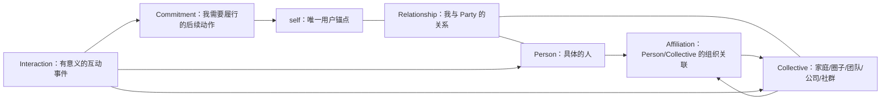

# Social Memory 领域模型草案

## 1. 设计目标

Social Memory 是 L1 `04-social` 的用户中心社交图谱。它只回答“谁或什么群体与我有关、我们如何相连、发生过什么、我需要履行什么”，不构建与用户无关的全局人物或组织数据库。

## 2. 领域图



`Party` 是 `Person | Collective` 的抽象类型，不单独落盘。`self` 是唯一锚点，不复制为普通 Person。

## 3. 一等对象

| 对象 | 语义 | 关键约束 |
|---|---|---|
| `Person` | 与我有关系的具体人 | 不允许仅凭同名自动合并 |
| `Collective` | 广义群体或组织 | 类型为 family/circle/team/company/community/household |
| `Relationship` | `self` 与一个 Party 的关系边 | 每条必须且只能有一个端点是 `self` |
| `Affiliation` | Person→Collective 或 Collective→Collective 的关联 | 不能替代我与该 Party 的 Relationship |
| `Interaction` | 一次有意义的接触事件 | 追加式；至少关联一个 Party |
| `Commitment` | 用户承诺或决定跟进的动作 | 必须有 owner、状态和到期规则 |

## 4. 核心不变量

1. V1 不保存与 `self` 无关的孤立 Party。
2. Relationship 的一端固定为 `self`；其他人与人之间的关系不在 V1 建模。
3. Interaction 只追加，不通过修改历史事件来美化当前关系。
4. Relationship 是当前摘要，Interaction 是事件依据；两者不得互相替代。
5. 推断不能直接成为事实。`inference` 只能进入 `_pending/`，经用户确认后仍保留其证据等级。
6. 第三方敏感事实缺少 `source_refs`、授权范围或核验日期时，不得进入正式层。
7. 合并必须由用户确认；同名、同公司、同群聊均不是充分条件。
8. 撤回后，对象不得继续被查询、建议、导出或重新自动创建。

## 5. 最小公共字段

```yaml
id: per_01...                 # opaque ULID；前缀按对象类型区分
kind: person                  # person|collective|relationship|affiliation|interaction|commitment
title: 关系维护用显示名
record_status: active         # active|inactive|archived|redacted|revoked
sensitivity: L3              # L0|L1|L2|L3
policy_tags: [third_party]
storage_class: local_private  # git_tracked|local_private|ephemeral
authorization:
  scopes: [store, summarize]  # store|summarize|suggest|share|remote_model
  basis: self_context         # self_context|public_source|explicit_consent
  retention_until: null
  revoked_at: null
verified: 2026-07-23
refresh: 90d
confidence: 1.0
source_refs: []
related: []
```

文件名默认使用 opaque ID，避免姓名出现在路径、Git diff 和错误日志中。显示名留在受权限控制的正文或 frontmatter。

## 6. 类型字段

### Person

```yaml
display_name:
aliases: []
handles: []
primary_collective_ids: []
```

`handles` 只保存平台内可撤销标识或指针，不保存密码、Token、证件号码等凭据。

### Collective

```yaml
display_name:
collective_type: company
aliases: []
parent_collective_id: null
```

Collective 只保存与用户关系维护有关的上下文。组织制度、业务资料和通用知识不进入 L1，应进入对应项目或 L2。

### Relationship

```yaml
self_id: self
party_id: per_01...
relationship_types: [friend, former_colleague]
state: active
effective_from: 2024-01-01
effective_to: null
last_meaningful_interaction_at: 2026-07-20
```

不提供关系价值分、影响力分或可操纵性评分。`state` 只能使用用户可解释的粗粒度状态。

### Affiliation

```yaml
subject_id: per_01...
collective_id: col_01...
role: member
effective_from: 2024-01-01
effective_to: null
```

### Interaction

```yaml
occurred_at: 2026-07-20T19:30:00+08:00
recorded_at: 2026-07-20T21:00:00+08:00
participant_ids: [per_01..., col_01...]
channel: in_person
summary: 用户确认后的最小必要摘要
evidence_level: artifact      # verbatim|artifact|impression|inference
commitment_ids: [com_01...]
```

### Commitment

```yaml
owner_id: self
party_ids: [per_01...]
description: 下周发送约定资料
commitment_status: open       # open|done|cancelled|expired
due_at: 2026-07-30
source_interaction_id: int_01...
```

## 7. 时态与证据

- Relationship/Affiliation：`effective_from`、`effective_to` 表达真实世界有效期。
- Interaction：`occurred_at` 与 `recorded_at` 分离，事件本身追加不改写。
- 当前事实：使用 `verified` 与 `refresh`；过期不自动判错，但展示陈旧警告。
- 证据等级沿用现有 `verbatim > artifact > impression`，并新增 `inference` 明确标识模型推断；任何 inference 均不得自动升格为事实。
- 冲突信息并存并进入待确认，不静默覆盖。

## 8. 存储等级与删除

敏感度回答“内容有多敏感”，存储等级回答“内容可以在哪里留下副本”，两者正交。

| storage_class | 用途 | Git/远端策略 | 删除语义 |
|---|---|---|---|
| `git_tracked` | 用户明确确认可长期保留的低敏摘要 | 可进入 Git；推远端仍需策略允许 | 普通删除不保证清除历史；硬删除需 purge |
| `local_private` | 默认社交记录与第三方数据 | 不进入任何 Git 历史，不交给未授权远程模型 | 支持受管范围内的本地硬删除与撤回传播 |
| `ephemeral` | 原始聊天、临时导入材料 | 永不进入 Git，处理后立即清理 | 处理完成即删除 |

任何要求“保证可撤回/硬删除”的内容不得选择 `git_tracked`。执行撤回时必须：

1. 将对象标记为 `revoked` 并阻断所有读取用途；
2. 清除本地私有正文、缓存、派生简报和搜索索引；
3. 删除或脱敏 Interaction/Commitment 中的反向引用；
4. 保留不含身份信息的最小 tombstone，防止自动重建；
5. 若内容曾进入 Git，明确提示需要历史清理和远端协调，不能宣称已硬删除。

purge 只对 GoldenWave 管理的正文、索引、缓存和派生视图提供验证。用户自建备份、文件系统快照、外部导出或已发送副本必须列入 purge report；未验证这些副本前不能宣称“已从所有位置删除”。

`record_status` 是所有对象共享的记录生命周期；`commitment_status` 只描述 Commitment 的业务进度。validator 必须按 kind 使用判别式 Schema，禁止用一个 `status` 字段承载两套状态机。

## 9. 授权模型

授权范围独立记录：

- `store`：保存结构化记录；
- `summarize`：从原始材料生成摘要；
- `suggest`：用于提醒或行动建议；
- `share`：对外展示或导出；
- `remote_model`：发送给远程模型处理。

`self_context` 允许用户保存维持关系所需的普通事实，但不允许敏感画像或外发。`explicit_consent` 指数据主体明确同意对应用途，而非用户在界面上的单方确认。健康、财务、政治、亲密关系、未成年人等 policy tag 默认要求 `explicit_consent`，且不默认授予 `share` 或 `remote_model`。

## 10. 身份合并

- ID 使用 `per_`、`col_`、`rel_`、`aff_`、`int_`、`com_` + ULID。
- 系统只能提出 merge candidate，不执行静默合并。
- 自动建议至少需要两个独立锚点；用户确认始终是最终条件。
- 合并保留 `merged_from`，更新所有引用，并生成可回滚审计记录。
- 拆分必须恢复原引用，不能复制同一 Interaction 到两个对象后丢失来源。

## 11. 分层与目录

```text
profile/04-social/                 # L1 逻辑入口和可跟踪摘要
  index.md
  people/
  collectives/
  relationships/
  affiliations/
  interactions/
  commitments/
.private/social/                   # local_private 实际内容；不进入任何 Git 历史
inbox/_pending/social/             # 未确认候选
.sources/                           # 用户显式保留的来源指针或材料
projects/                           # L4 会面准备、节日联系、关系回顾
```

Knowledge Base 根 `.gitignore` 必须排除 `.private/`。init 负责生成规则；validate/doctor 发现缺少 ignore 或 local_private 已被 Git 跟踪时必须 fail closed。

L1/L2/L3/L4 落位：

- L1：当前有效的用户中心社交图谱；
- L2：关系维护方法、授权政策等可复用知识，不保存私人画像；
- L3：Social Memory Patch 与安全摄入工作流；
- L4：会面准备、季度关系回顾等目标型执行容器；
- L5：允许跟踪内容的审计与回滚，不覆盖需要硬删除的私有正文。

## 12. 摄入管线

```text
capture -> route -> score -> merge-check -> consent-check
        -> redact -> render -> user-confirm -> inject
```

所有 Social Memory 候选默认进入 `_pending/`。第三方高敏内容、推断、身份合并、远程模型使用和外部分享没有自动直写路径。

## 13. SPEC 修改清单

1. `SPEC.md`：承认逻辑层与物理存储等级分离，并增加可撤回数据不进入 Git 的例外。
2. `spec/L1-profile.md`：把 `04-social` 升级为 Social Memory 子图谱并定义六类对象。
3. `spec/L3-workflow.md`：加入 merge/consent/redact 门禁，区分组织关系与组织知识。
4. `spec/governance.md`：增加 policy tags、授权范围、保留期限、撤回传播和存储等级。
5. `docs/v0.2-router-PRD.md`：增加社交数据安全测试向量与零静默合并要求。
6. `scripts/init.sh` 和 Skills：在 SPEC 通过后再实现新目录与行为，避免草案先污染稳定规范。
