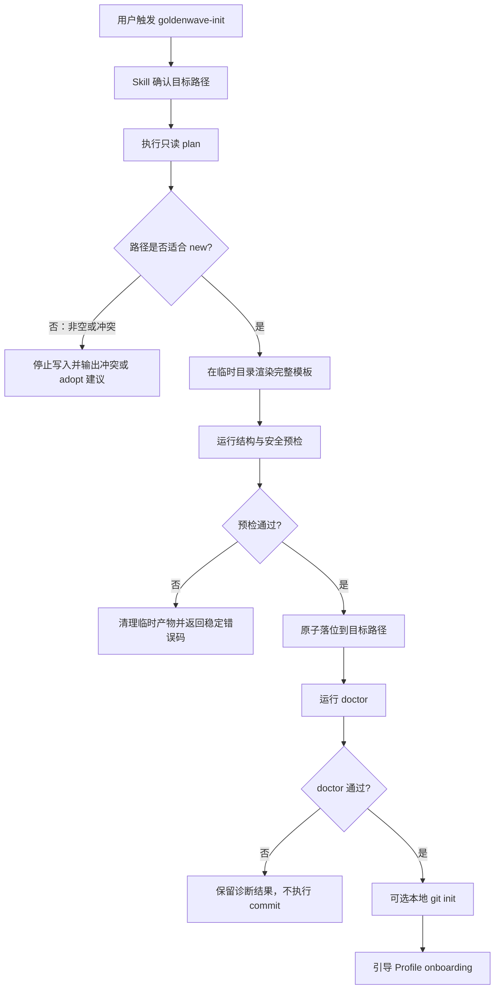
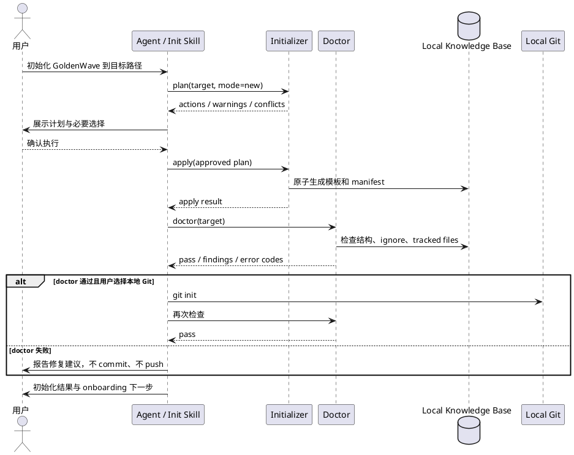

# PRD — GoldenWave Init Skill

## 1. 产品目标

| 维度 | 内容 |
|------|------|
| 项目名称 | GoldenWave Init Skill |
| 目标用户 | 使用 Claude Code、Codex 或兼容 Agent，希望建立本地个人上下文库的早期用户 |
| 核心价值 | 通过自然语言入口快速创建一个符合 GoldenWave SPEC、可验证、可审计且隐私默认安全的 Knowledge Base |
| 成功指标 | 新建空库 <= 5 分钟；重复执行零非预期 diff；私有数据误入 Git 为 0；冲突静默覆盖为 0 |
| 交付阶段 | Phase 1A Safe Bootstrap |
| 当前状态 | Phase 1A 已实现并通过内部 Gate；Contract 仍为 experimental |

## 2. 问题定义

当前仓库虽然已有初始化脚本与 Skill，但用户仍需要理解源码仓结构并手动完成多个步骤。现有脚本只生成部分 v0.1 骨架，没有当前 SPEC 要求的 `.private/` 安全门禁、版本 manifest、冲突计划和 doctor 验证，也无法作为一个自包含 Skill 脱离源码仓可靠运行。

本功能要解决的不是“多生成一些目录”，而是建立一个可信的首次使用边界：用户能够知道将发生什么、哪些文件由 GoldenWave 管理、初始化后是否安全，以及失败时是否留下不一致状态。

## 3. 产品原则

1. **Skill 薄、脚本厚**：LLM 负责理解意图和解释结果；确定性操作全部进入脚本。
2. **先计划、后写入**：对非空目录、冲突和 Git 行为先展示计划，禁止静默覆盖。
3. **doctor 先于 commit**：安全与结构检查未通过时不得建议提交。
4. **本地默认**：不联网、不配置 remote、不 push、不上传个人内容。
5. **新建与接管分离**：MVP 只承诺可靠新建；已有库通过独立 `adopt` 流程处理。
6. **同一内核**：Skill、根兼容脚本和未来统一 CLI 不得各自实现一套初始化规则。

## 4. User Journey Map

| 阶段 | 用户目标 | 系统行为 | 用户控制点 |
|------|----------|----------|------------|
| 触发 | 表达“初始化 GoldenWave” | Skill 识别 init 意图和目标路径 | 修改路径或取消 |
| 预检 | 知道会发生什么 | 脚本检查路径、环境、现有文件和 Git 状态，输出 plan | 审核冲突和 Git 选择 |
| 创建 | 获得标准个人库 | 脚本原子生成模板、manifest 与安全规则 | 不覆盖用户已有文件 |
| 验证 | 确认库可安全使用 | doctor 检查结构、ignore、Git 跟踪和版本 | 失败时查看可执行修复建议 |
| 启用 | 开始维护上下文 | 可选初始化本地 Git，随后引导 Profile onboarding | 是否 commit、填写哪些个人事实 |

## 5. 核心流程

## 6. 系统交互

## 7. 功能需求

### 7.1 Skill 入口

- 识别“初始化 GoldenWave”“新建个人知识库”“创建 GoldenWave Knowledge Base”等意图。
- 默认目标路径可使用 `~/KnowledgeBase`，但执行前必须回显规范化后的绝对路径。
- 只询问会改变结果的选择：目标路径、是否初始化本地 Git；其他选项使用安全默认值。
- 通过 Skill 自身目录定位 bundled scripts，不依赖当前工作目录或源码仓根路径。
- 优先消费脚本 JSON 输出，不解析装饰性终端文本。

### 7.2 Plan

- `plan` 是只读操作，不创建目标文件或初始化 Git。
- 检查运行时、目标路径、父目录权限、目标是否为空、是否位于危险路径、是否存在 Git 仓和符号链接越界。
- 输出规范化 target、将创建的目录和文件、Git 动作、warning、conflict 和计划摘要。
- `new` 模式遇到非空目录必须停止，不得退化为“仅补缺失文件”。

### 7.3 Apply

- 使用版本化 assets 生成当前 SPEC 所需目录和模板。
- 新建模式先在同一文件系统的临时目录完成渲染和预检，再原子移动到目标路径。
- 生成 `.kb/goldenwave.json`，至少记录 format version、initializer version、创建时间和受管模板 checksum。
- 同版本重复执行不得产生非预期 diff。
- 用户文件不因模板变化被覆盖；受管文件发生冲突时返回冲突结果。

### 7.4 Doctor

- 检查必需目录、必需文件、manifest 和基础 frontmatter。
- 检查 `.gitignore` 是否实际忽略 `.private/` 和明确的 ephemeral 路径。
- 在 Git 仓内使用 Git 行为验证 ignore，并检查 local_private 文件是否已被跟踪。
- 对安全门禁失败使用非零退出码，禁止仅输出 warning 后继续。
- 同时提供人类可读摘要和机器可读 JSON findings。

### 7.5 Git

- 允许用户选择初始化本地 Git 仓；不自动配置 remote 或 push。
- `.gitignore` 与 doctor 必须先于 `git add` 或 commit。
- MVP 不默认创建首次 commit；Skill 可在 doctor 通过后询问用户是否提交。
- 不生成会无条件 `git add -A` 并 push 的同步脚本。

### 7.6 Onboarding

- 初始化只生成包含占位内容的 `profile/console/me.md` 和访问策略模板。
- 个人事实填写属于后续 onboarding，不是 init 成功条件。
- Skill 不因“提高完成度”自动猜测或写入个人事实。

## 8. MVP 标准目录

MVP 至少生成：

- `AGENTS.md` 与兼容 Agent 的入口说明；
- `INDEX.md`、`kb-schema.md`、`glossary.md`；
- `wiki/` 八类页面目录与索引；
- `profile/console/me.md`、`profile/console/agent-contract.md`；
- `profile/persona/index.md`、九大事实域和 `profile/kb-schema.md`；
- `.private/social/`；
- `projects/`、`inbox/_pending/`、`.sources/`；
- `.kb/log.md`、`.kb/goldenwave.json`；
- 覆盖 local_private 和 ephemeral 路径的 `.gitignore`。

具体目录与字段以实施时已冻结的 SPEC 版本为准；PRD 不复制完整 schema。

## 9. 功能边界

**MVP 包含**：

- 空目录新建；
- `plan / apply / doctor`；
- 版本化模板与 manifest；
- 本地 Git 可选初始化；
- macOS、Linux、Windows 支持矩阵内的无第三方依赖脚本；
- 人类可读和 JSON 输出；
- 幂等、冲突、隐私门禁和失败清理测试。

**MVP 不包含**：

- 自动接管或改写已有 Knowledge Base；
- 自动迁移旧 GoldenWave 库；
- 自动安装 Git、Python、Agent 或编辑器；
- 自动配置 Git remote、push、云同步或遥测；
- 自动填写 Profile、摄入用户文件或生成 Context Pack；
- 生产级 Social Memory 运行时保障。

## 10. 后续能力

- `adopt`：只读扫描已有库，生成采用与迁移计划，经用户确认后分步执行。
- `upgrade`：依据 manifest 和模板 checksum 升级受管文件，保留用户修改并输出语义 diff。
- 统一 CLI：`goldenwave init / validate / doctor` 复用与 Skill 相同的内核。
- Agent adapters：按需生成 Claude Code、Codex 等适配入口，但不改变知识库标准。

## 11. 非功能约束

- **安全**：拒绝根目录、用户主目录本身、源码仓根等高风险目标；阻止路径穿越和符号链接越界。
- **隐私**：默认离线；日志、manifest 和错误信息不得记录个人正文。
- **可靠性**：新建流程失败时不留下半初始化目标；同版本重复执行幂等。
- **兼容性**：脚本只依赖冻结支持版本的 Python 标准库；路径含空格和非 ASCII 字符必须可用。
- **可观测性**：稳定退出码与结构化结果；不启用远程遥测。
- **可维护性**：模板、validator 和 Skill 不得复制 SPEC 的独立业务真相；变更顺序为 SPEC -> 模板/validator -> Skill。

## 12. 验收标准

- [ ] Skill 脱离 GoldenWave 源码仓安装后仍能定位并执行初始化脚本。
- [ ] 空目录初始化生成当前 SPEC 要求的全部 MVP 目录和文件。
- [ ] 同一目标重复执行两次，第二次不产生非预期文件 diff。
- [ ] `new` 指向非空目录时只输出冲突和建议，不写入任何文件。
- [ ] 初始化中途失败不会留下可被误认为成功的目标库。
- [ ] `.private/` 与 ephemeral 路径通过 Git 行为验证被忽略。
- [ ] 任一 local_private 文件已被 Git 跟踪时 doctor fail closed。
- [ ] doctor 未通过时不会执行 commit、remote 配置或 push。
- [ ] 默认流程不联网、不安装第三方依赖、不写入用户个人事实。
- [ ] 路径含空格和中文时初始化与 doctor 均通过。
- [ ] macOS、Linux、Windows 支持矩阵内的干净环境测试通过。
- [ ] 所有命令提供稳定退出码和合法 JSON 输出。

## 13. 交付顺序

1. 冻结 MVP 目录、ephemeral 路径和 manifest contract。
2. 实现模板、`plan/apply` 与临时目录原子落位。
3. 实现 doctor、Git 隐私门禁和稳定错误码。
4. 改造 `goldenwave-init` Skill 为薄编排层，并增加 `agents/openai.yaml`。
5. 将根 `scripts/init.sh` 改为兼容包装器，删除重复生成逻辑。
6. 完成临时目录 fixture、跨平台和失败恢复测试。
7. 更新 README Quick Start，开始真实 Knowledge Base 前的 sandbox 验证。
8. MVP 通过后再设计 `adopt/upgrade`。

## 14. 关联文档

- 产品简报：`../../context/product-initiated/goldenwave-init-202607/product_brief.md`
- 技术设计：`../../context/technical/goldenwave-init/init-skill-design.md`
- 项目战略：`../goldenwave-strategy/PRD.md`
- 进度追踪：`.artifacts/process.md`
- 决策记录：`.artifacts/notes.md`
