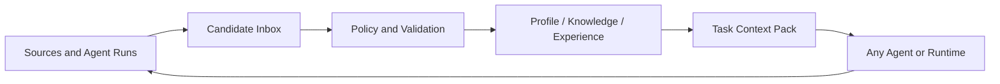
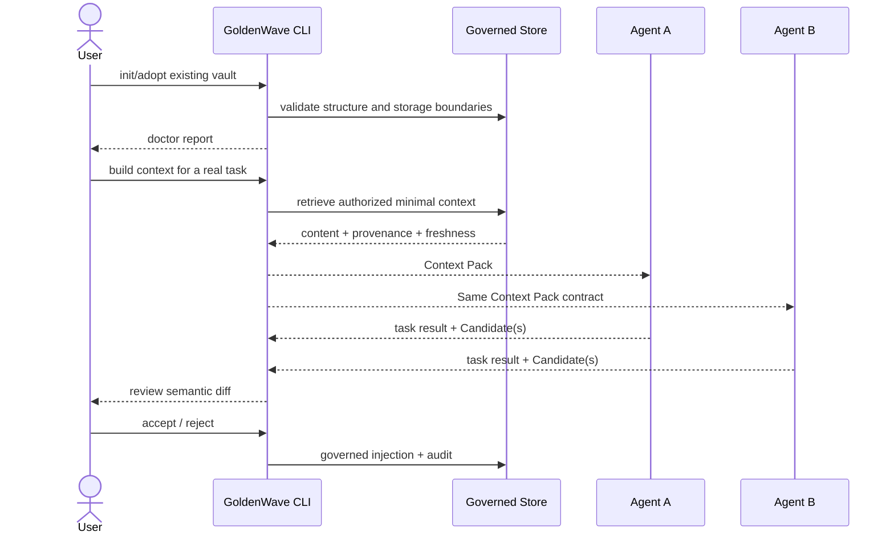

# GoldenWave 产品战略与迭代规划

## 1. 决策摘要

GoldenWave 采用 **个人验证后正式发布** 路径：仓库继续以 MIT 协议公开，但在张金波的真实 KnowledgeBase 和多 Agent 工作流完成端到端闭环前，只标记为 experimental，不承诺稳定 API、公共兼容性或生产可用。验证通过后再以开源产品身份发布稳定 Contract、CLI 与适配器并接受外部贡献。

当前产品定位为：

> **GoldenWave 是面向多 Agent 用户的、本地优先且可审计的个人上下文治理层。它把事实、知识和可复用经验转化为用户拥有、受治理、可被不同 Agent 安全使用的长期资产。**

长期愿景是个人 AI 操作系统；当前不以实现完整操作系统为交付目标。

核心承诺：**Govern once, use with any agent.**

## 2. 决策依据

本规划结合 GoldenWave 当前仓库和个人知识库中的以下实践与认知。为避免依赖仅存在于个人机器的链接，关键结论已提炼到仓库内的[研究摘要](../../context/product-initiated/goldenwave-strategy-202607/research_synthesis.md)。

| 知识资产 | 提供的关键证据 |
|---|---|
| `[[goldenwave开源项目]]` | 现有五层架构、Markdown + Git 与 SPEC + Skill 起点 |
| `[[个人操作系统五层架构]]` | Profile / Knowledge / Workflow / Project / Git 的职责边界 |
| `[[个人Profile事实档案系统]]` | 当前事实不能混入长期知识，需核验周期与敏感度 |
| `[[Profile与AI工作流数据治理协议]]` | 读取、写入、确认、隐私和回流需要统一治理 |
| `[[个人Agent协作Harness]]` | 同一用户已在多个 Agent、知识库和项目间真实工作 |
| `[[AI团队知识分层架构]]` | 工作流可替换，经过验证的领域知识才形成复利 |
| `[[Agent Loop治理层]]` | 自动化越强，越需要防失忆、误写和重复失败的治理薄层 |
| `[[Agent经验自进化闭环]]` | Trace 应先变成候选经验，再经验证晋升，而非静默自改 |
| `[[Agent Skills自进化与编排]]` | Skill Revision 需要来源、评测、版本、审核和回滚 |
| `[[OpenHuman个人Agent操作系统竞品观察]]` | 完整个人 Agent OS 有吸引力，但托管与黑盒记忆违背本项目红线 |
| `[[Pieces个人AI记忆层竞品观察]]` | 捕获是真需求，但捕获层与结构化治理层是上下游关系 |

上述资料支持一个共同判断：GoldenWave 的差异化不在“存更多”，而在把模型外部的个人上下文变成 **可信、可移植、可治理的资产**。

## 3. 问题与目标用户

### 3.1 核心问题

重度 AI 用户同时使用多个 Agent 时，个人上下文通常散落在聊天历史、工具私有记忆、Markdown、项目仓库和 Skill 目录中，导致：

1. 同一个用户在不同 Agent 中需要反复解释自己；
2. 事实、知识、人格和项目状态混杂，冲突时没有可信来源；
3. Agent 可以读取或写入内容，但缺少敏感度、授权、确认和撤回边界；
4. 项目经验停留在单次对话，无法受控地晋升为长期知识或 Skill；
5. 更换 Agent 或平台时，上下文资产难以迁移。

### 3.2 首要用户

V0 面向满足以下条件的 AI 重度用户：

- 同时使用至少两个 Coding Agent 或通用 Agent；
- 已有 Markdown、Obsidian 或项目文档资产；
- 在意本地存储、隐私、来源和可回滚性；
- 能接受 CLI 与 Agent Skill 作为早期交互面；
- 需要跨任务、跨项目持续复用个人上下文。

首个设计伙伴是张金波本人。个人 KnowledgeBase 是验证场，不直接等同于通用标准。

## 4. 产品边界

### 4.1 GoldenWave 负责什么

GoldenWave 的目标运行模型由四个内核组成；Store 与 Govern 先实现，Serve 与 Learn 分阶段验证，不把路线图能力描述为当前已交付能力：

| 内核 | 职责 | 核心产物 |
|---|---|---|
| **Store** | 表达和保存长期上下文、来源、稳定 ID 与存储等级 | Profile、Knowledge、Experience、Schema |
| **Govern** | 将写入变成 Candidate，完成分类、去重、权限、确认、注入和撤回 | Candidate Contract、Policy、Validator、Review Diff |
| **Serve** | 针对任务生成最小、可信、带来源的上下文包 | Context Pack、Agent Adapter |
| **Learn** | 从任务结果提取事实、知识、经验或 Skill 修订候选 | Revision Candidate、Evidence、Promotion Record |

### 4.2 GoldenWave 不负责什么

- 不自建聊天客户端或 Agent Runtime；
- 不承担通用任务调度与多 Agent 编排；
- 不替代 Obsidian、Notion 等编辑和浏览工具；
- 不自建全量 OS 级捕获器，连接器只作为可选 producer；
- 不允许外部 Agent 绕过治理流程直接修改正式层；
- 不在核心闭环验证前建设公共 Skill Registry、人格实例或完整 Social Memory 应用。

### 4.3 与生态的关系

| 相邻系统 | 主要职责 | 与 GoldenWave 的关系 |
|---|---|---|
| Obsidian / Markdown 编辑器 | 人类记录、编辑和浏览 | GoldenWave 管 Schema、治理与 Agent 合同 |
| Pieces / Connector | 捕获原始材料 | 作为候选来源，不是真相源 |
| Claude Code / Codex / Hermes | 执行任务 | 消费 Context Pack，提交 Candidate |
| Malow / Multica / Loop | Runtime、项目与协作 | 通过版本化 Contract 对接，不合并领域边界 |
| MCP / Agent Skills | 工具连接与程序性能力 | 作为适配面，不承载正式上下文真相 |

## 5. 优势、劣势与战略应对

### 5.1 已验证资产

1. **已有真实系统而非空白概念**：个人 KnowledgeBase 已长期使用 Profile、Knowledge、索引、项目上下文和多 Agent Harness。
2. **已有跨 Agent 使用场景**：个人 Harness 同时使用多个 Agent、项目仓库和同一 KnowledgeBase，具备真实验证环境。

### 5.2 已形成的设计资产（待工程验证）

1. **语义层与存储等级正交**：L1/L2/L4 回答内容是什么，`git_tracked/local_private/ephemeral` 回答如何保存；该设计旨在处理撤回与第三方数据，待 Phase 1 安全和恢复测试验证。
2. **治理链条可统一**：来源、置信度、敏感度、用户确认、审计、撤回和晋升可由同一 Candidate 协议连接。
3. **跨 Agent、弱工具绑定**：Markdown、CLI、Contract 和 Adapter 有机会让不同 Agent 共享同一可信来源。
4. **知识与能力可形成复利**：项目运行结果可受控地晋升为 Knowledge、Experience 或 Skill Revision Candidate。

这些是架构推论，不是已被产品数据证明的优势，分别由 Phase 1、2、3 的 Gate 验证。

### 5.3 劣势与风险

| 劣势 / 风险 | 影响 | 应对 |
|---|---|---|
| 当前以规范和文档为主 | 用户难以感知即时价值 | 优先交付可重复运行的黄金路径和 CLI |
| 五层叙事范围过大 | 容易同时建设多个产品 | 五层保留为信息模型，产品内核收敛为 Store/Govern/Serve/Learn |
| 首次理解成本高 | 新用户需掌握大量术语 | CLI 渐进披露，默认模板最小化，专家能力后置 |
| 治理价值不如自动记忆直观 | 传播和增长较难 | 用错误率、跨 Agent 成功率和可回滚演示价值 |
| 个人体系可能过拟合 | 通用性未经验证 | 先记录差异，再从两个外部设计伙伴提炼最小公共合同 |
| Markdown 在规模与查询上有限 | 大数据量下性能不足 | Contract 与逻辑模型独立于物理存储；Markdown 只做默认参考实现 |
| Social Memory 数据风险高 | 可能拖慢内核并扩大责任 | 保留设计资产，延后为领域验证，不进入近期主线 |
| 不可信材料可能注入指令或污染上下文 | Agent 被诱导泄露、误写或执行越权动作 | 建立内容/指令分离、来源信任级别和对抗测试集 |
| Adapter 或远程模型可能越权外传 | 本地优先承诺失效 | 默认 deny，显式 remote scope，输出前执行策略裁剪 |
| 审计日志可能泄露敏感正文 | 治理系统自身成为泄露源 | 日志只保留引用与脱敏摘要，增加日志扫描测试 |
| 并发 Candidate、崩溃和恶意载荷 | 覆盖更新、路径穿越或部分写入 | 使用 CAS/幂等键、路径白名单、事务式写入和恢复测试 |
| 本地损坏或误删 | 用户拥有但无法恢复 | doctor 检查备份状态，提供导出、恢复和迁移演练 |

## 6. 北极星与成功指标

### 6.1 北极星目标

> 同一份用户拥有的上下文，能够被至少两个不同 Agent 正确、安全、可追溯地消费，并在任务结束后形成受治理的增量。

### 6.2 指标体系

| 指标 | 定义 | 阶段目标 |
|---|---|---:|
| Time to First Governed Value | 从接入到完成首个 Context Pack 消费并闭环其产生的 Candidate | <= 15 分钟 |
| Cross-Agent Task Success | 两个 Agent 使用同一 Context Pack 完成黄金任务的比例 | >= 90% |
| Context Correctness | 黄金问题中事实、来源、新鲜度与权限均正确 | >= 95% |
| Unsafe Persistence | 敏感信息误入 Git、未授权写入、静默身份合并 | 0 |
| Candidate Closure Rate | 有价值候选被 accept/reject 明确闭环的比例 | >= 80% |
| Governed Learning Rate | 被接受候选中在后续任务被正确复用的比例 | >= 60% |
| Portability | 更换 Agent 后无需迁移专有数据库即可完成黄金任务 | 100% |

页面数、摄入量、Skill 数和 token 数仅作为诊断指标，不作为北极星。

### 6.3 指标测量协议

| 指标 | 起止事件 / 分母 | 判定与窗口 | 最小样本和数据源 |
|---|---|---|---|
| Time to First Governed Value | `adopt_started` 到同一 run 同时出现 `context_pack_consumed` 与其 Candidate `accepted/rejected` | 中位数；不含工具安装下载时间，失败计为未完成；Phase 0 只测人工代理流程，Phase 2 起测产品流程 | 本人 3 次干净环境；Phase 2 后由 2 名设计伙伴各 1 次 sandbox run；CLI event log |
| Cross-Agent Task Success | 预登记任务 x Agent 的执行次数 | Claude Code、Codex 分别按同一 rubric 判分；两者都通过才算该任务跨 Agent 成功 | 20 个真实任务，40 次执行；fixture、产物和独立判分记录 |
| Context Correctness | 黄金断言总数 | 事实值、来源、新鲜度、权限四项全部正确才通过；每 Phase 复跑 | 20 个任务且 >=100 条断言；Context Pack 与 expected manifest |
| Unsafe Persistence | 安全测试与真实 dogfooding 事件 | 测试集零失败；真实使用按月报告事件数，任一事件阻断发布 | Phase 1 对抗 fixture + 全量 audit log |
| Candidate Closure Rate | `accepted + rejected` / `reviewable_candidate_created` | 7 日窗口；过期未处理为未闭环 | 连续 30 日或至少 20 个候选；Candidate event log |
| Governed Learning Rate | 在预登记后续任务中正确复用的 accepted candidate / 被安排复用的 accepted candidate | 复用必须对 rubric 有正向贡献且无回归 | 至少 10 个 accepted candidate；replay report |
| Portability | 在第二个 Agent 中无需专有数据迁移即通过的黄金任务 / 选定迁移任务 | 每次发布前复测 | 至少 10 个迁移任务；adapter test report |

黄金结果由预先登记的 expected manifest 与 rubric 判分；涉及语义判断时，由非执行上下文的 Reviewer 复核。任何变更测试集或判分标准的操作必须记录版本，不能在看到结果后静默修改口径。

## 7. 首个黄金路径

黄金路径必须用真实 KnowledgeBase 和真实任务验证，不能只依赖合成 fixture。

## 8. 迭代计划

日期为方向性时间盒；只有满足退出 Gate 才进入下一阶段。

### Phase 0：战略与基线收敛（1 周）

**目标**：统一产品定义，建立 dogfooding 基线。

**交付**：

- 统一 README、SPEC、Roadmap 和核心术语；
- 将 Personal AI OS 明确为愿景，将四内核写入产品定义；
- 盘点真实 KnowledgeBase 的结构、隐私边界和现有 Agent 接入；
- 建立 20 个真实任务及黄金问题集；
- 用人工代理流程记录当前首次价值时间、跨 Agent 重复解释次数和错误类型；该数据只作现状基线，不声称是产品性能；
- 输出 Threat Model：信任边界、数据流、攻击面、权限矩阵和恢复目标；
- 招募至少 2 名外部设计伙伴，并完成不读取其私有正文的概念与安装访谈。

**Gate**：文档无定位冲突；人工代理基线过程和原始记录可复核；20 个任务覆盖 Profile、Knowledge、Project 三类上下文；Threat Model 评审通过；2 名外部设计伙伴确认核心问题存在。产品化指标基线待 Phase 2 CLI 与 Context Pack 可运行后建立；外部验证前所有 Contract 均标记 `experimental`。

### Phase 1：Trustable Core（3-4 周）

**目标**：从规范变成可确定运行的本地治理内核。

**交付**：

- 统一 `goldenwave` CLI；
- `init / validate / doctor`；
- 最小 `context-candidate/v0.1` Contract、fixtures 和 validator；
- `git_tracked / local_private / ephemeral` 门禁；
- 稳定 ID、来源、幂等键、错误码与审计记录；
- 现有 KnowledgeBase 的 adopt/doctor 流程。
- 路径穿越、恶意 envelope、日志脱敏、并发 CAS、崩溃恢复、备份恢复测试。

**Gate**：合法与非法 fixture 可确定判定；重复执行幂等；安全与恢复测试全部通过；敏感信息误入 Git 为 0；真实 KnowledgeBase 通过 doctor。Contract 保持 `experimental`。

### Phase 2：Cross-Agent Golden Path（3-4 周）

**目标**：证明“一份上下文，多个 Agent 可用”。

**交付**：

- `context build` 与 `Context Pack v0.1`；
- 最小检索策略、来源、新鲜度和权限裁剪；
- Claude Code 与 Codex 两个 Adapter；
- `candidate review / accept / reject` 和语义 diff；
- 20 个真实任务的对照评测报告。
- prompt injection、上下文投毒与跨 Agent 外传对抗集；
- 2 名外部设计伙伴完成 sandbox Context Pack 黄金任务，用于发现个人目录和分类假设；sandbox 可模拟 accept/reject 和完整事件流，但不得修改其正式 Store。

**Gate**：Cross-Agent Task Success >= 90%；Context Correctness >= 95%；首次价值时间 <= 15 分钟；对抗集零高危失败；所有正式写入可追溯；至少 2 名外部设计伙伴各完成 3 个 sandbox 任务，其中至少 1 个包含模拟 Candidate 闭环。只有外部验证后的最小交集可进入候选公共 Contract。

### Phase 3：Governed Learning Loop（4-6 周）

**目标**：证明系统能从使用中形成可验证复利。

**交付**：

- 从 Agent Run 提取 fact / knowledge / decision / pitfall candidate；
- Candidate 的来源、语义 diff、拒绝原因和回放证据；
- Experience 到 Knowledge 或 Skill Revision Candidate 的晋升协议；
- Malow 最小 producer 集成；
- 重复任务的质量、成本与回归评测。

**Gate**：至少 15 个真实候选明确闭环，其中至少 10 个为 accepted；至少 6 个 accepted candidate 在预先登记的后续任务中正确复用，Governed Learning Rate >= 60%；质量或成本有可测改善；黄金任务无显著回归。

### Phase 4：Domain Proof（4-6 周 / 选一）

**进入与选择 Gate**：Phase 3 全部通过后，以 Phase 3 预登记的连续 30 日观察窗口为准。若 `skill_or_workflow_candidate_created / reviewable_candidate_created >= 60%`，选择 Skill Governance；若含关系上下文的任务请求占全部登记任务请求 >=30%，且隐私门禁已通过外部评审，才可选择 Social Memory；否则延长 Phase 3，不为满足路线图强行进入领域建设。

**推荐先做 Skill Governance**：用 Candidate、评测、灰度、版本和回滚验证治理内核。Social Memory 保留为下一领域验证，用于检验身份消歧、用途授权、私有存储和撤回传播。

**交付**：

- 领域扩展 Schema 与公共 Candidate/Policy 接口映射；
- 至少 20 个领域 fixture、10 个真实候选和 5 个回放任务；
- canary、active-base CAS、回滚与失败恢复演练；
- 领域规则复用报告：来源、授权、确认、审计、版本、幂等与撤回必须复用公共服务，不得复制实现；
- 一名非作者用户完成端到端领域任务。

**退出 Gate**：公共治理规则复用率 100%；其计算方式为“通过公共接口实现的必需规则数 / 领域必需规则总数”，必需规则清单固定为来源、授权、确认、审计、版本、幂等、撤回七项，并由架构评审逐项提供调用证据；canary 和回滚演练全部通过；安全 fixture 零高危失败；10 个真实候选闭环；真实用户完成端到端任务。未通过时不得把领域扩展并入稳定 Contract。

### Phase 5：Open-Source Productization（3-4 周）

**进入条件**：

- CLI 和 Contract 经过个人真实工作流稳定验证；
- 至少 2 名外部设计伙伴完成黄金路径；
- 兼容策略、安全测试和迁移路径明确；
- 已识别并移除只适用于个人 KnowledgeBase 的硬编码假设。

**交付**：

- 单命令安装或明确的包管理器安装路径，干净环境验证；
- 从 experimental Contract 到首个稳定版本的迁移指南与兼容矩阵；
- threat model、安全边界、数据导出/删除/恢复文档；
- 最小示例库、故障排查、贡献指南和 release notes；
- 只读 MCP 是否进入首发由 Phase 2 数据决定，更多 Adapter 不作为首发阻塞项；
- 两名外部设计伙伴在发布候选版本上重新完成黄金路径。

**Release Gate**：支持矩阵内所有干净环境安装通过；迁移、备份恢复、安全和黄金任务测试全部通过；两个外部用户复测通过；所有 P0/P1 缺陷关闭；稳定 Contract 的兼容承诺与弃用策略已发布。公共 Registry、被动 Connector 和 Persona Instance 继续按证据决定，不预先承诺。

## 9. 当前项目调整

### 9.1 提升为近期主线

- `doctor`、Validator 和隐私门禁；
- 最小 Candidate Contract；
- Context Pack 与任务级最小上下文；
- Claude Code / Codex 双 Agent 验证；
- Candidate review/diff；
- 真实任务基准、失败样本和 dogfooding 报告。

### 9.2 保留但延后

- Social Memory Schema、Skill 和完整存储实现；
- Skill / Workflow Registry；
- 微信、IM 与 OS 级被动 Connector；
- L4 人格实例与 Agent Loop 自迭代；
- 写入型 MCP。

Social Memory 已完成的 PRD、领域模型和安全原则继续作为正式设计资产；其实施状态从“近期工程主线”调整为“Phase 4 领域验证候选”。

## 10. 不可破原则

1. 用户拥有正式上下文，核心价值不依赖单一 Agent 或托管服务；
2. 语义层与存储等级分离，需要硬删除的数据不得进入 Git；
3. 所有自动学习先产生 Candidate，不静默修改正式资产；
4. Context Pack 遵循最小必要原则，携带来源、新鲜度和权限信息；
5. Runtime 负责执行，GoldenWave 负责上下文治理；
6. 标准必须由运行实现和真实任务验证，文档不得长期领先实现；
7. 个人实践是设计输入，只有经过外部验证的最小交集才进入公共标准。

## 11. 主要待验证假设

| 假设 | 验证方式 | 失败后的调整 |
|---|---|---|
| 多 Agent 用户愿意维护一份可信上下文 | 个人闭环 + 2 名设计伙伴 | 若价值不足，收缩为个人 Harness 工具而非公共产品 |
| Context Pack 比全库扫描更可靠 | 20 个任务 A/B 测试 | 调整检索与打包策略，不扩大 Schema |
| 用户愿意审阅 Candidate | 测量闭环率与操作时间 | 引入批量规则、风险分级和默认策略 |
| Markdown 可作为早期默认实现 | 规模、延迟和冲突测试 | 保持 Contract，替换或增加物理存储适配器 |
| 治理能产生可传播的用户价值 | 记录避免的错误与跨 Agent 节省时间 | 将产品叙事从安全转向连续性与可移植性 |

## 12. 评审与变更规则

- 每个 Phase 结束时用 Gate 做继续、调整或停止决策；
- 每月复核北极星指标和主要假设，不以完成任务数量替代效果；
- 新增领域对象或接口前，必须说明它服务于 Store/Govern/Serve/Learn 中哪一项；
- 任何扩大自动写入或远程处理权限的变更必须单独评审。
