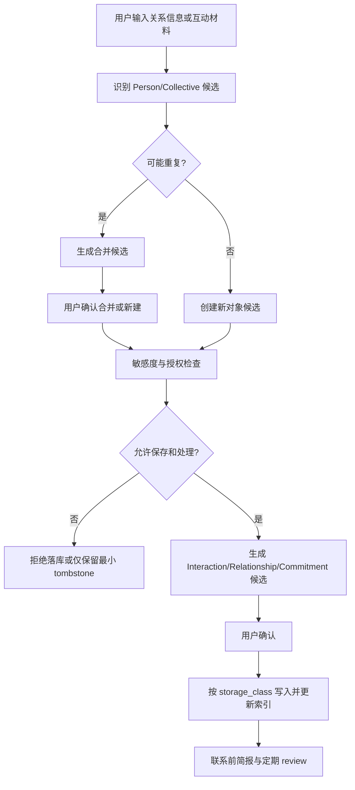
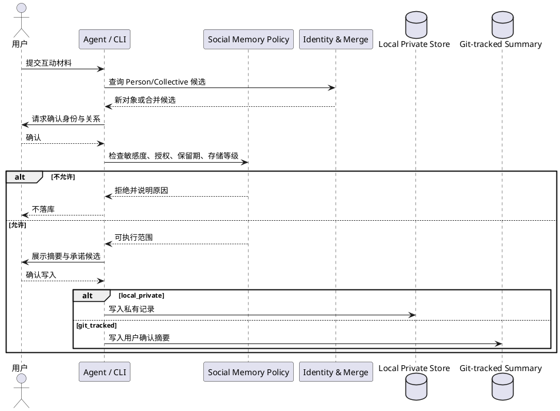

# PRD — GoldenWave Social Memory V1

> 2026-07-24 战略调整：业务设计继续有效，但工程实施从近期主线调整为 Phase 4 领域验证候选。只有 Trustable Core、Context Pack 和 Governed Learning Gate 通过，且关系上下文需求达到战略文档定义的选择阈值后，才重新进入实施规划。近期仅实现其依赖的通用存储等级、隐私门禁与 Candidate 能力。

## 1. 业务目标

| 维度 | 内容 |
|------|------|
| 项目名称 | GoldenWave Social Memory V1 |
| 目标用户 | 希望由个人 AI 辅助维护真实关系，同时保有数据控制权的 GoldenWave 用户 |
| 核心价值 | 以“我”为中心记住人与组织关系、互动和承诺，在不越过隐私边界的前提下帮助用户延续关系 |
| 成功指标 | 联系前 30 秒内恢复上下文；简报有帮助率 >=70%；未授权分享、敏感推断入库和静默错误合并均为 0 |
| 数据规模假设 | 单库 10,000 Party、100,000 Interaction 时仍可按索引渐进读取 |
| 交付阶段 | V1 先完成规范、Schema、测试向量和 Skill；CLI 在 GoldenWave 统一 CLI 中实现 |

## 2. 产品原则

1. **围绕我，不画像别人**：只记录维护用户真实关系所需的最少信息。
2. **人和组织都是一等对象**：Person 与 Collective 共同构成关系上下文。
3. **高信任、低自动化**：Agent 可整理、提醒、草拟，不自动发送、分享或建立敏感推断。
4. **事件是依据，摘要是视图**：Interaction 追加保存，Relationship 是可核验的当前摘要。
5. **可撤回优先于 Git 完整性**：需要硬删除的数据不进入 Git 历史。

## 3. User Journey Map

| 阶段 | 用户目标 | 系统行为 | 用户控制点 |
|---|---|---|---|
| 建立对象 | 记住重要的人或群体 | 创建 Person/Collective 与 Relationship | 确认对象、关系类型和存储等级 |
| 建立网络 | 理解人与组织如何相连 | 创建 Affiliation，提示可能重复对象 | 用户确认合并与有效期 |
| 互动后 | 留下以后真正用得上的信息 | 提炼 Interaction 和 Commitment 候选 | 用户确认摘要；原文默认丢弃 |
| 联系前 | 快速恢复必要上下文 | 生成关系简报 | 用户决定是否采纳建议或联系 |
| 定期维护 | 修正陈旧、冲突和待办 | 发起 review，展示依据与过期项 | 用户更新、归档、撤回或删除 |

## 4. 核心流程

## 5. 系统交互

## 6. 功能模块

### 6.1 Party 与关系图谱

**功能概述**：创建 Person/Collective，并通过 Relationship/Affiliation 表达与用户相关的关系。

**前置条件**：用户主动输入对象，或从互动材料中确认创建候选。

**操作步骤**：

1. 系统提取最小身份锚点并查询可能重复对象。
2. 用户选择新建、关联既有对象或取消。
3. 用户确认与 `self` 的 Relationship；需要时补充 Affiliation 及有效期。

**预期结果**：对象获得 opaque ID；Relationship 必含 `self`；Person 可关联多个 Collective；索引可从任一对象反查相关边。

**异常情况**：

| 场景 | 系统响应 |
|---|---|
| 仅姓名相同 | 只提示候选，不自动合并 |
| Affiliation 缺少 Collective | 先创建或选择 Collective 候选，不生成悬空边 |
| 与我无关的孤立对象 | 拒绝进入 V1 正式层 |
| Collective 包含通用业务知识 | 路由到 L2/L4 或拒绝，不写入社交图谱 |

**业务规则与数据约束**：对象类型、ID、边不变量和时态字段以[领域模型](../../context/technical/social-memory/domain-model.md)为准。

### 6.2 互动与承诺

**功能概述**：把一次有意义的联系保存为最小摘要，并将用户需要履行的动作提升为 Commitment。

**前置条件**：Interaction 至少关联一个 Person 或 Collective。

**操作步骤**：

1. 用户输入手写摘要或提供临时原始材料。
2. 系统生成参与者、时间、渠道、摘要和承诺候选。
3. 用户确认、修改或拒绝候选，系统按存储等级写入。

**预期结果**：Interaction 追加保存；原始材料默认不复制；Commitment 具有 owner、`commitment_status` 和到期规则；Relationship 更新最近互动视图。

**异常情况**：

| 场景 | 系统响应 |
|---|---|
| 无法确定参与者 | 进入 `_pending/`，不创建匿名正式事件 |
| 摘要含未授权敏感推断 | 删除相关候选并解释拦截原因 |
| 新信息与旧事实冲突 | 并列展示来源，等待用户确认 |
| 原始材料要求保留 | 要求用户明确选择 storage_class 和 retention |

**业务规则与数据约束**：原始聊天默认 `ephemeral`；所有社交候选默认需要用户确认；Interaction 不通过覆盖修改历史语义。

### 6.3 联系前关系简报

**功能概述**：在联系前 30 秒内恢复必要且可靠的关系上下文。

**前置条件**：用户主动请求某个 Party 的简报。

**操作步骤**：

1. 系统读取 Party、Relationship、Affiliation、近期 Interaction 和未完成 Commitment。
2. 系统按授权范围过滤，并标记陈旧、低置信和推断内容。
3. 用户查看摘要，选择更新事实、完成承诺或自行采取行动。

**预期结果**：简报包含关系背景、组织上下文、最近互动、未完成承诺、边界与新鲜度提示；不包含无关原文和禁止用途数据。

**异常情况**：撤回对象不生成简报；过期事实必须显示截止日期；来源缺失的内容标记“无法核验”。

**业务规则与数据约束**：简报是运行时视图，不作为新的真相源；Agent 不得依据简报自动发送消息。

### 6.4 核验、合并、归档与撤回

**功能概述**：保持身份和关系信息可纠错、可归档、可撤回。

**前置条件**：用户主动 review，或数据超过 refresh 周期、发生冲突/重复候选。

**操作步骤**：

1. 系统列出陈旧事实、冲突、重复候选和过期承诺。
2. 用户逐项确认更新、合并、拆分、归档或撤回。
3. 系统传播引用变更并写入允许范围内的审计记录。

**预期结果**：无静默覆盖或合并；撤回对象从查询、建议、导出、缓存和索引中消失；保留无身份信息的 tombstone。

**异常情况**：若数据曾进入 Git，系统不得宣称已硬删除，必须提示执行历史 purge 与远端协调。

**业务规则与数据约束**：归档可恢复；撤回默认不可被自动重建；拆分和合并均需可回滚引用映射。

### 6.5 隐私与授权门禁

**功能概述**：在保存、摘要、建议、分享或远程模型处理前进行用途授权。

**前置条件**：任何包含第三方信息的写入或读取动作。

**操作步骤**：

1. 系统计算 sensitivity、policy_tags 和所需 authorization scope。
2. 系统将动作限制在已有授权范围内；缺失授权时请求用户决定。
3. 系统根据 storage_class 执行或拒绝，并记录保留期限。

**预期结果**：普通关系事实可基于 `self_context` 本地保存；敏感属性、人格推断、外发和远程模型处理默认拒绝；所有主动对外动作由用户触发。

**异常情况**：授权过期或撤回立即阻断后续用途；未成年人和特殊类别信息没有自动降级路径。

**业务规则与数据约束**：`store/summarize/suggest/share/remote_model` 分别授权，不能以一次同意替代全部用途。

## 7. 功能交互

| 链路 | 数据流转 | 影响 |
|---|---|---|
| Interaction → Relationship | 追加事件后更新当前摘要与最近互动时间 | 不修改历史 Interaction |
| Interaction → Commitment | 用户确认后创建后续动作 | 简报与 review 展示未完成项 |
| Person → Affiliation → Collective | 将人物置于组织上下文 | Collective 不因此成为组织知识库 |
| Revocation → Index/Brief/Cache | 传播撤回状态并删除派生内容 | 对象不再参与查询和建议 |

## 8. 功能边界

**V1 包含**：

- Person、Collective、Relationship、Affiliation、Interaction、Commitment 六类对象；
- 互动摘要、联系前简报、承诺跟进、身份消歧、核验与撤回；
- policy tags、用途授权、保留期限和三类存储等级；
- Schema、合法/非法示例、安全测试向量和 Agent Skill 行为规范。

**V1 不包含**：

- 全量聊天长期归档、被动社交平台抓取和后台监控；
- 自动发送、自动加好友、自动送礼或自动对外同步；
- 人格画像、可操纵性标签、关系价值评分和影响力排名；
- 企业 CRM、销售 pipeline、团队通讯录或组织知识库；
- 多用户共享社交图谱和云端托管。

## 9. 非功能约束

- **隐私**：社交记录默认 L3 + `local_private`；第三方高敏数据、远程模型和分享均需显式授权。
- **可删除性**：需要保证硬删除的数据不得进入 Git；撤回必须传播到索引、缓存和派生简报。purge report 必须列出无法由 GoldenWave 验证的备份、快照、导出和已发送副本。
- **Git 泄露门禁**：根 `.gitignore` 必须排除 `.private/`；validate/doctor 发现 local_private 被跟踪时必须失败。
- **性能**：在规模假设内，按 ID 查询单个关系简报的本地 P95 <= 1 秒；全库 review 可渐进输出。
- **一致性**：写入对象与边必须原子更新索引；失败时不留下悬空引用。
- **可移植性**：Schema 与业务规则不绑定 Claude、Codex、Cursor、MCP 或特定模型。
- **可观测性**：默认不启用遥测；本地审计不得记录姓名、原文或未脱敏敏感内容。

## 10. 验收标准

- [ ] 可创建 Person 与所有 V1 Collective 类型，并建立以 `self` 为端点的 Relationship。
- [ ] 可记录 Person/Collective Affiliation，且不会把组织通用知识写入 L1。
- [ ] Interaction 至少关联一个 Party，原始聊天默认不长期保存。
- [ ] 联系前简报包含近期互动、组织上下文和未完成承诺，并显示陈旧/低置信标记。
- [ ] 同名、同公司或同群聊不会触发静默合并；测试集错误自动合并数为 0。
- [ ] 第三方高敏内容、推断和缺少授权的候选 100% 不直写正式层。
- [ ] Agent 无法自动发送、分享、导出或调用未授权远程模型。
- [ ] 撤回会阻断查询和建议，并清除索引、缓存和派生简报中的引用。
- [ ] 对曾进入 Git 的数据，系统明确区分普通删除与历史 purge，不虚假承诺硬删除。
- [ ] `.private/` 缺少 ignore 或任一 local_private 文件已被 Git 跟踪时，validate/doctor fail closed。
- [ ] 所有合法/非法 Schema fixture、合并、冲突、撤回与权限测试通过。

## 11. 交付顺序

1. 评审并冻结领域模型与隐私原则。
2. 修改 `SPEC.md`、L1、L3 和 governance 规范。
3. 发布 `social-memory-patch/v0.1.0` Schema、fixture 和 validator。
4. 更新 init 骨架、profile/ingest Skills 和 `_pending/` 决策卡。
5. 在统一 CLI 中实现 `social add/log/brief/review/forget`。
6. 用真实但脱敏的场景集完成安全与可用性验收。

## 12. 关联文档

- 产品简报：`../../context/product-initiated/social-memory-202607/product_brief.md`
- 领域模型：`../../context/technical/social-memory/domain-model.md`
- 进度追踪：`.artifacts/process.md`
- 决策记录：`.artifacts/notes.md`
